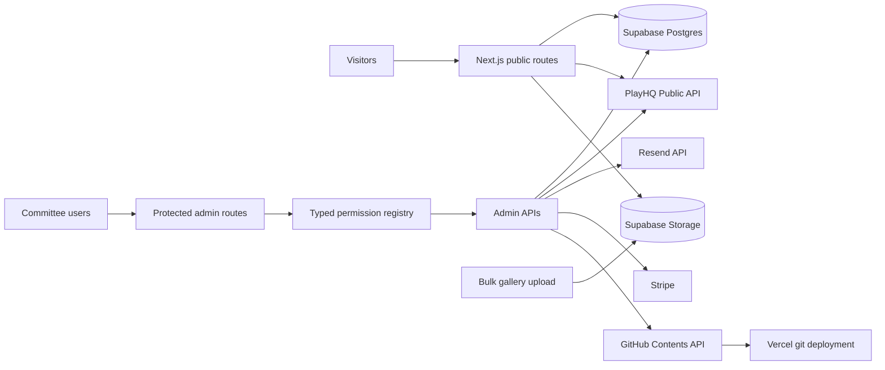

# Newcomb and District Cricket Club Website

Official website and committee content-management system for Newcomb and District Cricket Club (NDCC), the Dinos.

**Production:** [www.ndcc.com.au](https://www.ndcc.com.au)

This repository contains:

- the public club website;
- a permission-controlled committee CMS;
- seasonal registration, appointments and club-season management;
- PlayHQ-backed fixtures and fantasy cricket administration;
- merchandise, ordering and payment workflows;
- news, events, calendar, gallery, sponsors, publications, kitchen, membership and volunteer modules;
- production integrations for Supabase, Vercel, Resend, Stripe and GitHub-backed media.

## Current Operating Model

| Area | Current implementation |
| --- | --- |
| Public application | Next.js App Router application deployed on Vercel |
| Public content | Supabase-backed CMS content read at request time with no-store behaviour |
| Committee CMS | Custom cookie-session authentication with server-enforced module permissions |
| Club seasons | One canonical current season, plus draft, upcoming, completed and archived seasons |
| Fixtures | Official PlayHQ Public API only, with no manually entered fixture dataset |
| Fantasy cricket | Multi-season manager experience with PlayHQ-assisted imports and admin review |
| Sponsors | One active A-Z sponsor list, plus CMS-controlled homepage marquee behaviour |
| Merchandise | CMS catalogue, order windows, sizing guides, order handling and supplier workbook export |
| Payments | Manual bank-transfer mode by default, with separately gated Stripe Payment Link and Checkout paths |
| App email | Resend API through the server-only application email helper |
| Authentication email | Supabase Auth SMTP, configured independently from app email |
| Single CMS media | GitHub Contents API commit under `public/images`, followed by Vercel git auto-deployment |
| Bulk gallery media | Direct browser upload to Supabase Storage through short-lived signed upload tokens |
| Deployment | Vercel production deployment from the configured Git branch, with scheduled cron routes |

Runtime environment variables and dashboard settings determine which optional integrations are active. Do not infer production readiness from code presence alone.

## Architecture



### Source-of-truth boundaries

- Supabase is the source of truth for mutable CMS and operational records.
- `supabase/migrations` and `supabase/remote-migration-history.json` define the reconciled database migration history.
- PlayHQ is the source of truth for fixtures and supported imported cricket statistics.
- GitHub stores versioned application code and single-file CMS media committed under `public/images`.
- Supabase Storage stores bulk gallery originals.
- Vercel environment variables and scheduled functions define deployment-time behaviour.
- Resend handles application transactional email.
- Supabase Auth SMTP handles fantasy authentication email.
- Stripe settles only the payment paths explicitly enabled by server configuration and CMS controls.

## Technology Stack

| Layer | Package or service |
| --- | --- |
| Framework | Next.js `14.2.35`, App Router |
| UI runtime | React `18`, React DOM `18` |
| Language | TypeScript `5` |
| Styling | Tailwind CSS `3.4.1` |
| Motion | Framer Motion `12.40.0` |
| Icons | Lucide React |
| Theme handling | `next-themes` |
| Database and auth | Supabase Postgres, `@supabase/supabase-js` `2.99.1`, `@supabase/ssr` `0.9.0` |
| Calendar | FullCalendar `6.1.21` |
| App email | Resend `6.12.3` |
| Payments | Stripe server SDK `22.4.0` |
| Image processing | Sharp |
| Hosting and cron | Vercel, region `sin1` |
| Continuous integration | GitHub Actions on Node.js `22`, with PostgreSQL `16` for database tests |

The package is marked private and is not intended for npm publication. The repository uses `npm` with a committed lockfile.

## Local Development

### Prerequisites

- Node.js 22, matching the GitHub Actions runtime
- npm
- access to the required Supabase project or a suitable development project
- only the external credentials needed for the feature being tested

### Install

```bash
npm ci
```

Use `npm ci`, not `npm install`, so local dependencies match `package-lock.json`.

### Configure

Copy the annotated environment template:

```bash
cp .env.example .env.local
```

On Windows PowerShell:

```powershell
Copy-Item .env.example .env.local
```

Populate only the values required for the current environment. Never commit `.env.local`, service-role keys, API keys, webhook secrets, SMTP credentials, bank details or GitHub tokens.

### Run

```bash
npm run dev
```

Open `http://localhost:3000`.

The `predev` and `prebuild` hooks generate the current apparel assets before development or production builds.

## Environment Variables

`.env.example` is the canonical annotated variable list. The groups below explain ownership and exposure.

### Browser-safe variables

Only variables intentionally prefixed with `NEXT_PUBLIC_` may enter the browser bundle:

- `NEXT_PUBLIC_SUPABASE_URL`
- `NEXT_PUBLIC_SUPABASE_ANON_KEY`
- `NEXT_PUBLIC_SITE_URL`

### Server-only groups

| Group | Main variables | Purpose |
| --- | --- | --- |
| Supabase | `SUPABASE_SERVICE_ROLE_KEY` | Server-side CMS and operational access |
| Payments | `PAYMENT_PROVIDER`, `PAYMENT_TEST_MODE`, `STRIPE_SECRET_KEY`, `STRIPE_WEBHOOK_SECRET` | Manual, Payment Link or Checkout selection and settlement |
| PlayHQ | `PLAYHQ_API_BASE_URL`, `PLAYHQ_TENANT`, `PLAYHQ_API_KEY`, `PLAYHQ_ORGANISATION_ID`, `PLAYHQ_DEFAULT_SEASON_ID`, `PLAYHQ_DEFAULT_GRADE_IDS`, `PLAYHQ_CACHE_REVALIDATE_SECONDS` | Fixtures and PlayHQ-backed season data |
| Fantasy automation | `CRON_SECRET`, `PLAYHQ_FANTASY_SYNC_ENABLED`, `PLAYHQ_FANTASY_SYNC_BATCH_SIZE` | Guarded scheduled and on-demand fantasy sync |
| App email | `RESEND_API_KEY`, `RESEND_FROM_EMAIL`, `RESEND_FROM`, `EMAIL_TEST_MODE` | Server-side application notifications |
| Contact recipients | `CONTACT_TO_EMAIL`, `CONTACT_CC_EMAILS`, `CONTACT_BCC_EMAILS` | Notification routing |
| Bank transfer | `NDCC_BANK_ACCOUNT_NAME`, `NDCC_BANK_BSB`, `NDCC_BANK_ACCOUNT_NUMBER` | Order and payment instructions |
| CMS media | `GITHUB_CONTENTS_TOKEN`, `GITHUB_REPO_OWNER`, `GITHUB_REPO_NAME`, `GITHUB_CONTENTS_BRANCH`, `GITHUB_MEDIA_BASE_PATH`, `GITHUB_COMMITTER_NAME`, `GITHUB_COMMITTER_EMAIL` | Single-file CMS upload commits |
| Admin diagnostics | `ADMIN_AUTH_READINESS_ENABLED`, `ADMIN_DIAGNOSTIC_TOKEN`, `DIAGNOSTIC_MUTATION_ENABLED` | Temporary, explicitly enabled authentication diagnostics |
| Cookie scope | `AUTH_COOKIE_DOMAIN` | Optional bare-domain cookie scope |

Supabase Auth SMTP values are configured in the Supabase dashboard. They are documented in `.env.example` for operator reference but are not read by the app's Resend helper.

## Database and Migrations

Supabase Postgres stores CMS content, committee users and sessions, orders, payments, club seasons, fantasy data, calendar records and other operational modules.

### Migration rules

- Treat `supabase/migrations` as the application migration source.
- Reconcile it with `supabase/remote-migration-history.json`.
- Run `npm run check:migrations` before release.
- New migrations must use a unique full `YYYYMMDDHHMMSS` prefix.
- Do not rename or replay historical migrations without following the reconciliation runbook.
- `supabase/schema.sql` is a dated legacy snapshot, not the authoritative migration history.
- A brand-new environment needs the documented migration-reconciliation process because some production tables predate the current migrations folder.

See [Migration History Reconciliation](docs/operations/20260716-Migration-History-Reconciliation-Rev00.md).

### Safe change sequence

1. Add the smallest forward-only migration.
2. Update `supabase/remote-migration-history.json` only when the migration has genuinely been applied to the tracked remote environment.
3. Run migration-history and replay checks.
4. Validate application behaviour against the migrated schema.
5. Keep rollback data-safe and explicit.

## Committee Authentication and Access

The CMS uses custom committee authentication, separate from Supabase Auth used by fantasy managers.

### Initial setup

1. Apply the custom committee-auth migrations and every later auth or permission migration.
2. Bootstrap the first administrator through `POST /api/admin/auth/bootstrap`.
3. Sign in at `/admin/login`.
4. Manage users and access from `/admin/users`.

### Roles

| Role | Access model |
| --- | --- |
| `admin` | Full CMS and user-management access |
| `president` | Full CMS and user-management access |
| `secretary` | Full CMS and user-management access |
| `vice_president` | Full CMS and user-management access |
| `treasurer` | Full CMS and user-management access |
| `committee` | Explicit per-module permissions, with existing action restrictions retained |
| `fantasy_manager` | Automatic full Fantasy-only access |
| `fantasy_support` | Explicitly selected Fantasy-only permissions |

The central registry in `lib/auth/permissions.ts` controls navigation, direct admin routes, resource APIs, dedicated APIs and shared media upload. A hidden menu item is not the security boundary. Server permission checks are.

Changing a user's role or permissions revokes active committee sessions.

### Session behaviour

- Cookie name: `ndcc_committee_session`
- Absolute session life: 14 days
- Admin warning: 9 minutes of inactivity
- Client sign-out: 10 minutes of inactivity
- Server idle expiry: 15 minutes, allowing a small grace for in-flight requests
- Root middleware redirects cookie-less `/admin/*` requests to `/admin/login`

## CMS Navigation and Modules

The admin navigation is grouped for non-technical committee users. Common modules are shown first. Specialist modules sit behind `More tools`, and the navigation can be searched.

| Group | Main modules |
| --- | --- |
| Home | Dashboard |
| Season | Start New Season, Player Registration, Club Details, Teams, Appointments, Training and Calendar |
| Publish | News, Publications, Events, Pages and Links, Page Sections, Gallery |
| Club | History, Minutes |
| Community | Volunteers, Memberships, Enquiries |
| Commercial | Sponsors, Merchandise, Kitchen, Orders, Payments |
| Fantasy | Fantasy Home, Seasons and PlayHQ, Players, Imports, Historical Review, PlayHQ Diagnostics |
| Administration | Users, Email Diagnostics, Media Diagnostics, Password |

Each user sees only the modules allowed by their role and effective permission set.

### Content ownership

Use the dedicated module when one exists:

- News and announcements: `/admin/news`
- Publications and downloadable documents: `/admin/publications`
- Events and registrations: `/admin/events`
- Calendar and training dates: `/admin/calendar`
- Gallery albums and images: `/admin/gallery`
- Sponsors: `/admin/sponsors`
- Merchandise catalogue, options and windows: `/admin/apparel`
- Orders and payment records: `/admin/orders` and `/admin/payments`
- Club and contact details: `/admin/club-details`
- Teams and grades: `/admin/teams`
- Seasonal appointments: `/admin/season-appointments`
- Player registration: `/admin/season/registration`
- Reusable page sections: `/admin/content`
- Page links, buttons and navigation cards: `/admin/site-pages`

Do not hardcode routine season copy, public links or editable club content in page components when the corresponding CMS control exists.

## Club-Season Workflow

Club seasons are managed independently from fantasy seasons.

### Season states

- `draft`
- `upcoming`
- `active`
- `completed`
- `archived`

Only one season is canonical and current.

### Starting a season

Use `/admin/season/new`.

The wizard follows:

1. Season details
2. Review
3. Activate

The core details are the season name, start date and end date, with optional PlayHQ season mapping and scheduled activation. Creation is idempotent, and activation runs through the database season-activation function.

New season registration starts safely:

- status closed;
- public links hidden;
- copied audience labels or terms retained where available;
- previous registration URLs cleared;
- copied options inactive.

### Player registration

Use `/admin/season/registration` to manage:

- public page title and introductory text;
- header navigation label;
- status and visibility;
- open and close times;
- ordered audience options;
- Terms and Conditions;
- exact PlayHQ registration URLs.

Open or waitlist states require at least one active valid option. Closed, archived or expired settings do not expose a clickable registration link. Registration changes are read live and do not normally require a deployment.

### Seasonal appointments and signings

The current season controls whether season appointments are publicly shown. Close the section through the active-season setting when signings are no longer relevant, rather than editing page code or carrying a stale year into the next season.

Public seasonal copy should derive from the active season, not a hardcoded year.

## Sponsors

Current sponsors are presented as one active alphabetical list.

- Public ordering uses locale-aware A-Z sorting.
- Routine sponsor management does not require public tier grouping.
- Sponsorship packages and tier selection remain part of the prospective-sponsor enquiry flow.
- Missing logos use an identifiable branded text fallback, not an invented logo.
- Sponsor links open only when a website is present.

### Homepage marquee

The homepage marquee:

- uses CMS-controlled `slow` or `very_slow` speed;
- allocates 5 or 7 seconds per sponsor, with a 60-second minimum cycle;
- provides an explicit pause or play button;
- pauses when appropriate for visibility;
- becomes static for reduced-motion preferences;
- hides the irrelevant motion control when reduced motion is active.

## Merchandise, Orders and Payments

### Merchandise catalogue

The public merchandise area is managed through `/admin/apparel` and supports:

- products and selectable options;
- merchandise order windows;
- controlled public visibility;
- product imagery;
- apparel sizing guidance;
- payment configuration fields.

The current sizing-guide interface contains 16 supplied charts grouped by garment type. It includes previous, next and reset controls, keyboard shortcuts, full-size image links and an accessible chart list.

### Supplier workbook export

Authorised merchandise users export through the admin merchandise flow.

The export:

- claims only merchandise orders that have not previously been exported;
- uses one atomic batch update shared across authorised users;
- prevents a later export from repeating an earlier batch;
- restores the batch markers if workbook generation fails;
- returns an `.xlsx` workbook named with the Australia/Melbourne date.

The workbook contains four sheets:

1. `Master`
2. `Custom bags`
3. `2627 - Order 1`
4. `2627 - Order 1 Summary`

The two order sheets preserve the supplier's required naming convention. They are export-format labels, not the website's active-season source of truth.

### Payment modes

`PAYMENT_PROVIDER` selects the server path:

| Mode | Behaviour |
| --- | --- |
| `manual` | Creates the order, payment reference and bank-transfer instructions |
| `stripe_payment_link` | Shows a product-specific external Stripe Payment Link when configured |
| `stripe_checkout` | Creates a Stripe-hosted Checkout Session for an existing server-priced order |

Manual is the default in `.env.example`. The actual production mode must be verified from the target environment.

Stripe Checkout remains unavailable unless all required gates agree:

- `PAYMENT_PROVIDER=stripe_checkout`;
- key mode matches `PAYMENT_TEST_MODE`;
- `STRIPE_WEBHOOK_SECRET` is present;
- the CMS Checkout switch is enabled.

The signed Stripe webhook is the settlement authority. Do not mark an order paid from a browser redirect alone.

## Fixtures and PlayHQ

Fixtures come from the official PlayHQ Public API only.

Required server values:

- `PLAYHQ_API_KEY`
- `PLAYHQ_ORGANISATION_ID`

The API base URL defaults to `https://api.playhq.com`. The tenant defaults to Cricket Australia's `ca` short name. Optional season, grade and cache settings are documented in `.env.example`.

Rules:

- never prefix PlayHQ secrets with `NEXT_PUBLIC_`;
- never add a manually entered fixture dataset;
- never scrape PlayHQ;
- show a clear PlayHQ call-to-action when configuration or data is unavailable;
- use CMS-managed team links and club settings for public PlayHQ destinations.

See [PlayHQ Setup](docs/PlayHQ_Setup_Rev00.md).

## Fantasy Cricket

Fantasy cricket is multi-season and separate from the club-season presentation model.

Public features include:

- registration and authentication;
- manager account;
- draft and submitted squads;
- transfers and chips;
- private leagues;
- player and manager leaderboards;
- season selection;
- squad carry-over into a new season as a target-season draft.

Admin features include:

- fantasy seasons and PlayHQ grade mapping;
- players, roles, prices and availability;
- rounds, locks and scoring;
- import batches and publication;
- reconciliation and historical review;
- manager review;
- automatic and on-demand PlayHQ sync.

PlayHQ imports are resumable and idempotent. Unsupported, ambiguous or name-only matches are held for review rather than guessed. Imported statistics affect public scoring only after the intended validation and publication path.

The daily cron calls `/api/cron/playhq-fantasy-sync` at `16:30 UTC`. `CRON_SECRET` guards the route. Admins can run the same orchestrator on demand.

See:

- [Fantasy Seasons and PlayHQ Runbook](docs/operations/20260710-NDCC-Fantasy-Seasons-PlayHQ-Run-Rev00.md)
- [PlayHQ Fantasy Automation](docs/operations/playhq-fantasy-automation.md)

## Calendar

The club calendar is separate from ticketed events.

Public capabilities include:

- month, week and list views;
- type filters and search;
- event details;
- ICS download;
- optional home and contact previews.

Admin capabilities include:

- list and month views;
- create, edit, duplicate and status changes;
- batch actions;
- Melbourne-local date and time entry;
- per-surface visibility.

Calendar records are stored in UTC and displayed in Australia/Melbourne club time.

See [Calendar CMS Runbook](docs/operations/20260708-NDCC-Calendar-CMS-Run-Rev00.md).

## Email

The project has two independent email systems.

### App transactional email

`lib/email.ts` uses the Resend API for application notifications such as contact, volunteer, event, membership, order, kitchen and fantasy-manager messages.

- configuration is server-only;
- `EMAIL_TEST_MODE=true` simulates app sends;
- missing or failed email configuration does not undo a completed database write;
- delivery must be verified in the target Resend environment before it is described as live.

### Supabase Auth email

Fantasy confirmation, sign-in and password-reset email is controlled by Supabase Auth SMTP.

- configure it in the Supabase dashboard;
- do not duplicate it with a custom app route;
- verify Site URL and redirect URLs in the target project;
- test confirmation and password-reset flows independently from app email.

See [Email Setup](docs/email-setup.md).

## Media

### Single CMS media file

Admin image fields use the GitHub Contents API.

1. The server validates the configured repository, branch and media path.
2. The file is committed under `public/images` or an allowed subdirectory.
3. The CMS stores a browser path beginning with `/images/`.
4. The Git commit triggers the configured Vercel git deployment.
5. The image becomes public after that deployment succeeds.

Do not configure a Vercel deploy hook for this path. The Git commit already triggers deployment, and a second hook can create duplicate deployment attempts.

Use `/admin/media-diagnostics` to inspect configuration presence and test repository access without committing a file.

### Bulk gallery upload

Bulk gallery uploads use Supabase Storage rather than GitHub.

- originals upload directly from the browser through short-lived signed tokens;
- the Vercel function handles metadata, not image bytes;
- albums start as drafts;
- publishing requires a consent acknowledgement;
- partial failures never auto-publish;
- deletion and orphan cleanup are explicit and count-confirmed;
- deleting an album does not silently delete its stored originals.

## Public Data Freshness

Mutable CMS pages and public CMS APIs are request-time and no-store.

- successful live queries are authoritative, including a successful empty result;
- fallback content is used only when the environment is unconfigured or a live query fails;
- fallback rows are not merged over successful live results;
- CMS edits normally appear without a deployment;
- GitHub-backed media is the exception because the file must first reach a successful Vercel deployment;
- PlayHQ caching remains separately configurable.

Do not reintroduce build-time seed content, ISR or shared cache layers for mutable CMS routes without a deliberate data-freshness review.

## Security Model

Key controls include:

- server-only secrets;
- custom committee session authentication;
- module permissions enforced at route and API boundaries;
- role and permission validation;
- session revocation after access changes;
- Supabase RLS where applicable;
- signed bulk-upload tokens;
- signed Stripe webhooks;
- idempotent payment and import paths;
- no-store admin and mutable public responses;
- GitHub secret scanning;
- blocking critical dependency audit in CI;
- security headers in `next.config.mjs`.

The Content Security Policy is currently report-only. Do not switch it to enforcement until Stripe, Supabase, Google embeds, Next.js runtime behaviour and current inline requirements have been verified in the real application.

## Project Structure

```text
app/
  public routes                 Public club, fixtures, fantasy and content pages
  admin/                        Protected committee CMS
  api/                          Public, admin, integration and cron APIs
components/
  admin/                        CMS components and controls
  common/                       Shared images, motion and utility components
  fantasy/                      Fantasy UI
  home/                         Homepage sections
  layout/                       Navbar and footer
  ui/                           Reusable UI primitives
lib/
  auth/                         Committee auth, guards and permission registry
  orders/                       Merchandise workbook and order helpers
  payments/                     Payment configuration and reconciliation
  playhq/                       PlayHQ config, client and normalisation
  server/                       Server-only integration helpers
  public-data.ts                Public CMS reads
  fallback-content.ts           Degraded-state fallback content
  email.ts                      Resend app email helper
public/
  images/                       Versioned public and CMS-uploaded assets
scripts/
  admin/                        User provisioning and administration scripts
  production/                   Explicit production scripts
  restore/                      Recovery and diagnostics scripts
  test-*.mjs                    Deterministic focused tests
  smoke-*.mjs                   Route and content smoke tests
supabase/
  migrations/                   Forward database migrations
  remote-migration-history.json Reconciled remote migration manifest
  schema.sql                    Legacy snapshot
docs/
  operations/                   Operator runbooks and incident procedures
middleware.ts                   Admin login redirect boundary
next.config.mjs                 Images and security headers
vercel.json                     Region and cron configuration
```

## Common Commands

| Command | Purpose |
| --- | --- |
| `npm run dev` | Start local development |
| `npm run lint` | Run Next.js ESLint checks |
| `npx tsc --noEmit` | Run a direct TypeScript check |
| `npm run build` | Build the production application |
| `npm run smoke` | Smoke-test core routes |
| `npm run smoke:content` | Smoke-test CMS-driven content routes |
| `npm run smoke:fantasy` | Smoke-test fantasy routes |
| `npm run check:assets` | Check required public assets |
| `npm run check:migrations` | Validate migration history |
| `npm run audit:public` | Audit the public site contract |
| `npm run test:admin-auth` | Test committee authentication |
| `npm run test:admin-permissions` | Test module permission enforcement |
| `npm run test:cms-navigation` | Test permission-aware CMS navigation |
| `npm run test:player-registration` | Test seasonal registration behaviour |
| `npm run test:sponsor-presentation` | Test A-Z sponsor and marquee presentation |
| `npm run test:merch-export` | Test the four-sheet supplier workbook export |
| `npm run test:apparel-images` | Test apparel sizing assets |
| `npm run test:stripe` | Test Stripe integration contracts |
| `npm run test:calendar` | Test calendar validation and time handling |
| `npm run test:fantasy-orchestrator` | Test PlayHQ fantasy automation |
| `npm run test:fantasy-reconciliation` | Test fantasy import reconciliation |
| `npm run test:migration-replay` | Replay database migrations against PostgreSQL |

Run the focused tests for the changed behaviour, then run lint and the production build. Database tests require PostgreSQL.

## Continuous Integration

`.github/workflows/pr-validation.yml` runs on every pull request and every push to `main`.

### `validate`

Uses Node.js 22 and runs:

- permission, auth, CMS navigation and schema tests;
- lint;
- migration and asset checks;
- PlayHQ normalisation;
- fantasy orchestration, reconciliation, season and smoke tests;
- content smoke tests;
- apparel pricing;
- payment and Stripe tests;
- player registration;
- merchandise export;
- production build.

### `database-tests`

Uses PostgreSQL 16 and runs:

- apparel catalogue database tests;
- payments ledger tests;
- full migration replay.

### `security-scans`

Runs:

- Gitleaks secret scanning;
- blocking `npm audit --audit-level=critical`;
- informational high-severity dependency audit.

A CI pass does not replace live Vercel, Supabase, Resend, Stripe, PlayHQ or browser acceptance where a change affects those systems.

## Deployment and Scheduled Work

Vercel is configured for region `sin1`.

Scheduled routes:

| Route | UTC schedule | Purpose |
| --- | --- | --- |
| `/api/cron/keep-alive` | `0 5 * * *` | Daily keep-alive |
| `/api/cron/playhq-fantasy-sync` | `30 16 * * *` | Daily bounded fantasy sync |

Operational rules:

- environment-variable changes require a new deployment;
- CMS content changes usually do not;
- GitHub-backed media requires the automatic deployment triggered by its commit;
- do not add a second deploy hook to the media path;
- validate the actual deployment and public route before claiming a production change is complete;
- dashboard settings in Vercel, Supabase, Resend, Stripe, GitHub and the DNS provider are not controlled by this repository.

## Operator Runbooks

- [Admin Auth Diagnostics](docs/Admin_Auth_Diagnostics_Rev00.md)
- [Email Setup](docs/email-setup.md)
- [PlayHQ Setup](docs/PlayHQ_Setup_Rev00.md)
- [Calendar CMS](docs/operations/20260708-NDCC-Calendar-CMS-Run-Rev00.md)
- [Fantasy Seasons and PlayHQ](docs/operations/20260710-NDCC-Fantasy-Seasons-PlayHQ-Run-Rev00.md)
- [Migration History Reconciliation](docs/operations/20260716-Migration-History-Reconciliation-Rev00.md)
- [Supabase I/O Incident Runbook](docs/operations/SUPABASE_IO_INCIDENT_RUNBOOK.md)
- [CMS Recovery](docs/operations/june16-cms-recovery.md)
- [PlayHQ Fantasy Automation](docs/operations/playhq-fantasy-automation.md)

## Change Rules

Before changing the repository:

1. Read `AGENTS.md`.
2. Inspect the current branch and worktree.
3. Preserve public routes, admin routes, API routes, CMS behaviour, Supabase behaviour, media upload behaviour and payment behaviour unless the task explicitly changes them.
4. Do not invent public names, dates, prices, sponsor benefits, PlayHQ links, committee details, contact details, URLs or payment behaviour.
5. Keep important event information as accessible HTML, not only inside images.
6. Use meaningful alt text and optimise large public images.
7. Add the smallest focused test for changed observable behaviour.
8. Run the relevant checks, lint and build.
9. Prefer a small reviewable pull request.
10. Verify the live system separately when the change affects an external service.

## Known Operational Constraints

- Optional integrations are code paths, not proof of current production configuration.
- Supabase Auth email depends on target-project SMTP configuration.
- Stripe Checkout depends on matching server keys, webhook configuration, provider selection and CMS enablement.
- Historical migration bookkeeping requires the remote-history manifest and reconciliation runbook.
- GitHub-backed CMS media is not public until its deployment succeeds.
- Bulk gallery originals are preserved unless explicitly cleaned up.
- PlayHQ imports hold ambiguous records for review instead of guessing.
- Public CMS freshness depends on retaining request-time no-store behaviour.
- The Content Security Policy is report-only pending real-interface validation.
- Dashboard settings and secrets must be maintained outside the repository.

## Licence

All rights reserved. Newcomb and District Cricket Club.
